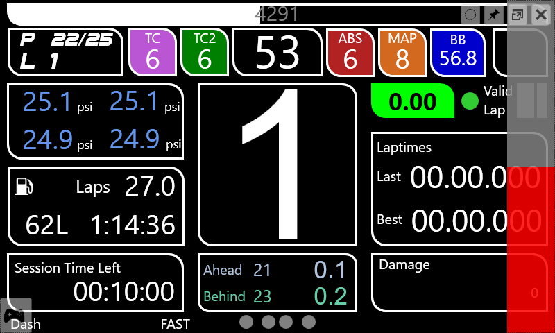
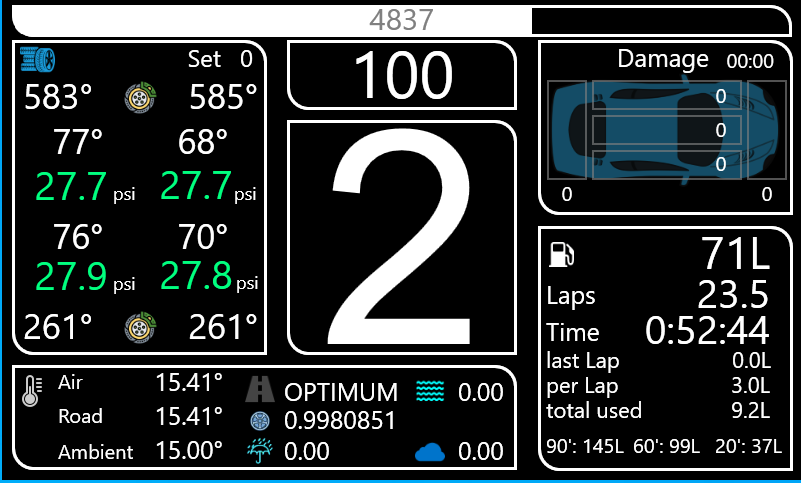

# SimHub Dashes

This is the repository for all my self made SimHub Dashes I'm using in my racing sim.

* **miBigDisplay**: 1920x1080 diplay to be viewed on my 37" TV showing race data (standings, timing, laps, positions), car data (tyre pressures/temps, oil/water/exhaust temps) and computer data (fps, cpu/gpu temps, load, fanspeed)

* **miACC**: Dash designed for the Vocore screens supported by SimHub. Tried to put as much information relevant during a race on one screen

On the left and right side are 10step spotter bars that show the distance to a car.

The Detail screen shows more information about tyres, weather, track, fuel and damage.

- tyre and brake temps and pressures
- track and weather infos
- damage info
- more detailed fuel info

# Installation

To install a dash in SimHub, just download the .simhubdash file and doubleclick it. It should automatically be installed in the SimHub dash-repository.

For the miBigDisplay also the file "miBigDisplay.js" is needed. Download and copy it to the "JavascriptExtension" folder of your SimHub installation - that's it.
