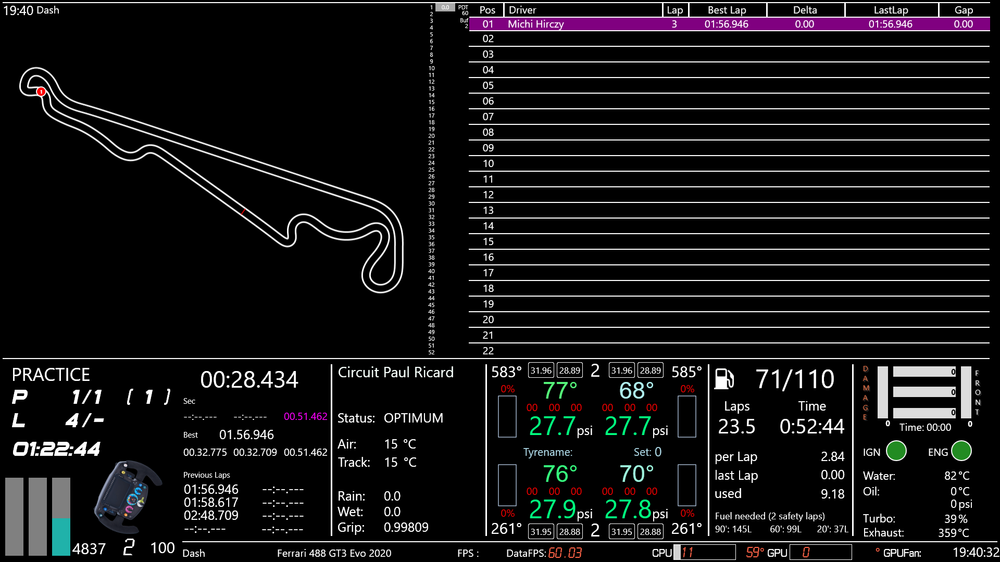

# SimHub Dashes

This is the repository for all my self made SimHub Dashes I'm using in my racing sim.

* **miBigDisplay**: 1920x1080 diplay to be viewed on my 37" TV showing race data (standings, timing, laps, positions), car data (tyre pressures/temps, oil/water/exhaust temps) and computer data (fps, cpu/gpu temps, load, fanspeed)

* **miACC**: Dash designed for the Vocore screens supported by SimHub. Tried to put as much information relevant during a race on one screen

